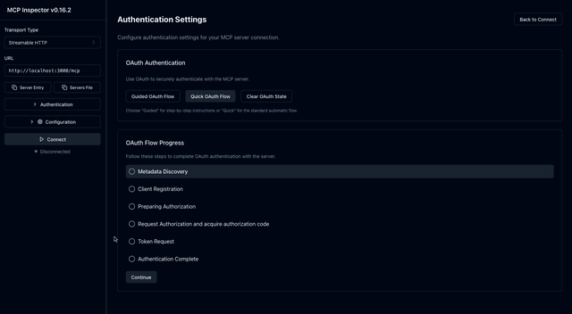

# typescript-sdk

This directory contains the Porsche specific typescript SDK to aid
implementing MCP servers.

The currently implemented modules are:

- **Entra Dynamic Client Registration Proxy**: This module makes it simple
  to use Entra that does not support dynamic client registration as an
  authentication server for an MCP server. For a sample usage, have
  a look at [`src/examples/mcpServerDcrProxyEntraStreamableHttp.ts`](src/examples/mcpServerDcrProxyEntraStreamableHttp.ts).

## Usage

To start a sample Entra-protected MCP server locally with a `me` tool that
fetches information about the currently logged-in user, create a `.env` file
copying from `.env.example`:

```shell
cp .env.example .env
```

Replace all placeholder values with valid values you get from an
Entra app registration. Next, launch the MCP server with built-in proxy via

```bash
npm run dev:server
```

This will start up the MCP server at `http://localhost:3000`.

To connect to the MCP server, you can use any MCP-compliant client
and connect to `http://localhost:3000/mcp`.

Here's a sample login using MCP Inspector



[MCP Inspector](https://github.com/modelcontextprotocol/inspector)
is a great tool - simply point it against `http://localhost:3000/mcp`,
start the quick or guided OAuth flow and check out the tools / resources it provides.
